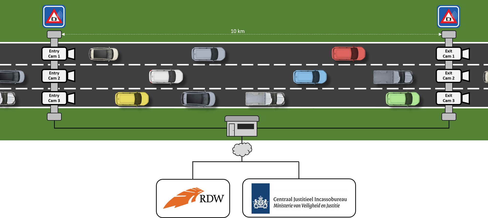
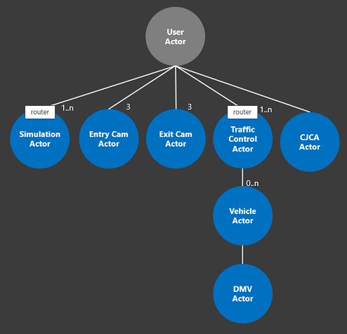
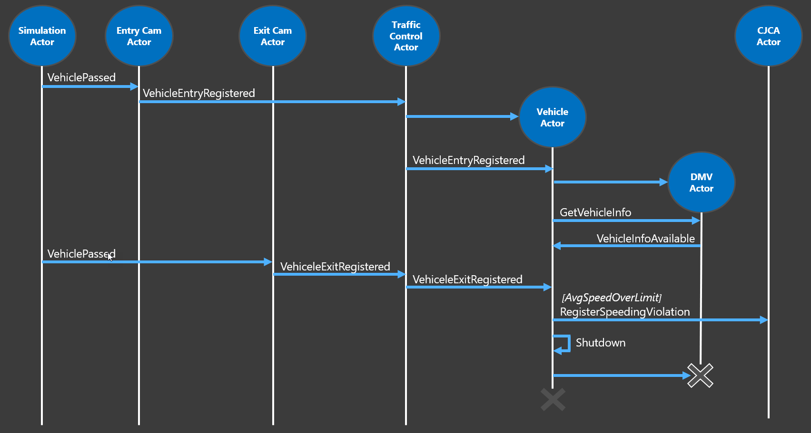

# Akka.NET Traffic Control Sample
Sample code of an Actor Model based traffic-control system using Akka.Net. For this sample I've used a speeding-camera setup as can be found on several Dutch highways. Over the entire stretch the average speed of a vehicle is measured and if it is above the speeding limit on this highway, the driver of the vehicle receives a speeding ticket.

### Overview
This is an overview of the fictitious setup I used for this sample:

There's 1 entry-camera and 1 exit-camera per lane. When a car passes an entry-camera, the license-number of the car is registered. 

In the background, information about the vehicle  is retrieved from the Department Of Motor-vehicles - DMV (or RDW in Dutch) by calling their web-service. 

When the car passes an exit-camera, this is registered by the system. The system then calculates the average speed of the car based on the entry- and exit-timestamp. If a speeding violation is detected, a message is sent to the Central Judicial Collection Agency - CJCA (or CJIB in Dutch) will send a speeding-ticket to the driver of the vehicle.

### Actor hierarchy
I've used an Actor model approach to build this sample using [Akka.NET](http://getakka.net). The actor hierarchy used in the sample looks like this:

- There is 1 actor per entry/ exit-cam. 
- The *Traffic Control Actor* handles vehicles detected by the camera's. Because this is the actor that has to take care of the load in this system, I've used a router using a round-robin routing-strategy to distribute the messages over multiple actors.
- The *Vehicle Actor* represents a single detected vehicle. I've chosen to create an actor for every registered vehicle because this actor needs to manage the state for a vehicle. After a vehicle has left the area and is handled, the accompanying vehicle actor is removed.
- The *DMV Actor* handles communication with the DMV for retrieving vehicle information. The *CJCA Actor* handles communication with the department of justice for registering speeding violations and sending speeding-tickets.
- The *Simulation Actor* simulates traffic driving on the highway. It sends messages to the entryand exit-camera actors with random intervals. Because I want to be able to vary the load on the system, I've used a Broadcast router here.

### Interaction
To describe how the actors interact with each-other in this system, I've created the following sequence-diagram:

### Solution
The solution contains several projects:

- Actors - contains all the actors in the system.
- Messages - contains a definition of all the messages used in the system.
- Host - a console application hosting the actors in the system (except the CJCA Actor).
- CJCAHost - a console application hosting the CJCA actor.
- PersistencePlugin - a custom file-based implementation of a persistence provider for persistent actors.

The solution contains 2 console-apps that act as a hosting process for an actor-system. This is because by default, the CJCA Actor is created in a separate process in order to demo Akka.Remote. When testing the application, make sure you have both the Host as the CJCAHost project configured as startup-project in the solution. By looking at the *AkkaConfig.hocon* configuration in both the projects, you can see how remote actor-deployment is configured.

In the CJCAHost project, the custom persistence-provider is configured. This is used by the *PersistentCJCAActor* defined in the *Actors* project. If you create a *PersistentCJCAActor* in stead of a *CJCAActor* in the *Program.cs* file in the *Host* project, this will make sure the state of the actor is stored in a file on disk and loaded when the actor starts. In the *AkkaConfig.hocon* file in the *CJCAHost* project, the target folder for the file is configured. By default this is `d:\temp\akkajournal`. You can change this by changing the config file. Make sure you use double backslashes in the path!

### Disclaimer
The code in this repo is NOT production grade and lacks any automated testing. It is intentionally kept as simple as possible (KISS). Its primary purpose is demonstrating several Actor Model concepts and not being a full fledged application that can be put into production as is.

The author can in no way be held liable for damage caused directly or indirectly by using this code.
